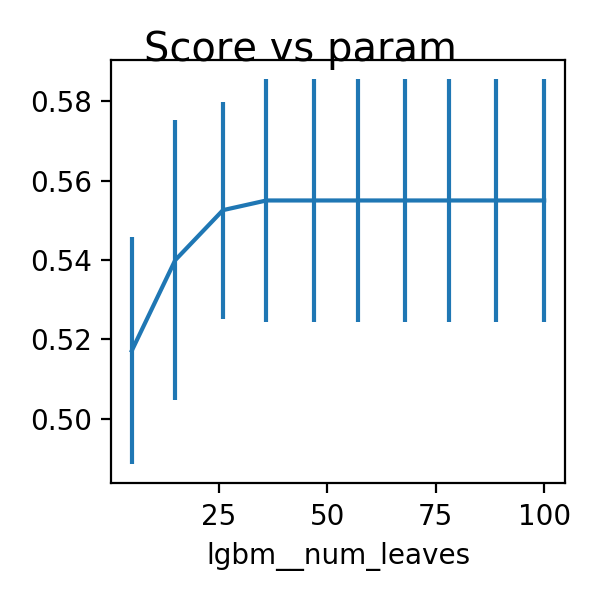

# task1 

Brain Age Prediction

## Data imputation

Missing data was found in both the training data and the test dataset. After comparision, the median of each feature was used for replacement. 

Data is then standaized.

## Feature selection

Two simple data transformation methods including `SelectKBest` and `PCA` were compared. In the round of comparsion, `PCA` was out-performed by `SelectKBest`.

200 out of 832 in the original data was selected empirically.

## Model

Multiple regression were compared using cross-validation score on training dataset.
`Ridge` was used as baseline, `SVR` performs badly on this task.
In terms of the balance between runtime and accuracy, `LGBMRegressor` is probably the best one. 
Tree-base algorithm seems to have the best performance and the final prediction comes from the `LGBMRegressor`.

## Data transformation

Standazation of data was performed after imputation and low variance ones were filtered out. Test data set were transformed using the same pipeline fitted by training data.

