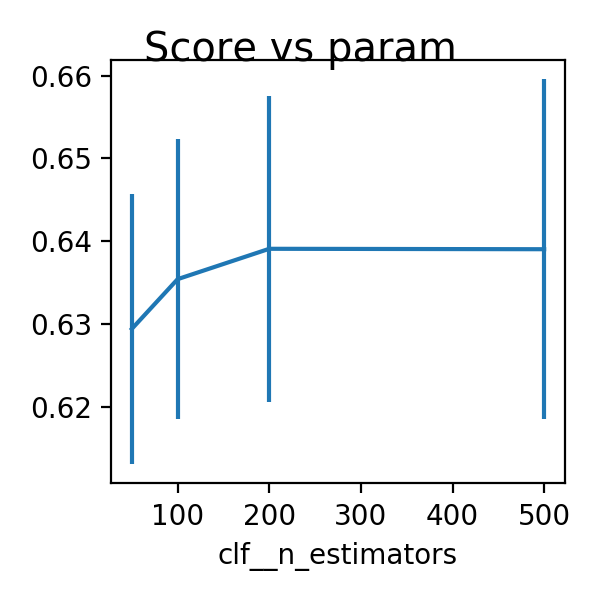
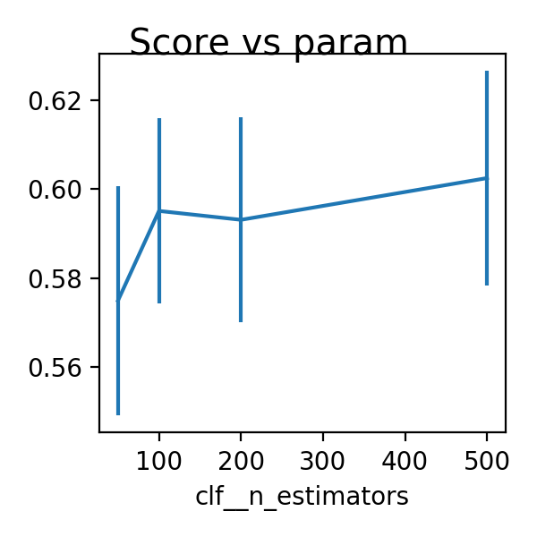

# task1 

Disease Classification

## Data

Training data consists of `X_train` of shape `(4800, 1000)` and corresponing class label with no missing values.

Since the `X` came from image data, it is assumed that the feature selection reducing the dimensions for classfier would certainly result in a loss of spatial information and thus leave to a worst prediction results. This is further confirmed by the `0.546009142434` (k=200) and 
(k=1000)`0.566955223235`. Howeverm the difference is not significant and the low score reflects merely on the class imbalance.

The number of samples for class `0, 1, 2` are 600, 3600, 600 respectively.

## Effect on outliers removal

Using `LocalOutlierFactor` with default parameters, 4320 out of 4800 were chosen. 

`0.676 +/- 0.022` was achieved with under-sampling, SVM combined with outliers removal. However, this resulted in a drop in the final submission score to `0.681531898726`. As in the case of SVM, lowering sample number might not aid in shaping the decision function.

## Under-sampling vs over-sampling


<details>
  <summary>Scores were based on the code below</summary>
  
    ```python
    cv = ShuffleSplit(n_splits=5, test_size=0.2, random_state=0)
    cv_score = cross_val_score(
        pipeline, X, y, cv=cv, scoring='balanced_accuracy')
    print("{:.3f} +/- {:.3f}".format(np.mean(cv_score), np.std(cv_score)))
    ```
</details>

```python
cv = ShuffleSplit(n_splits=5, test_size=0.2, random_state=0)
cv_score = cross_val_score(
    pipeline, X, y, cv=cv, scoring='balanced_accuracy')
print("{:.3f} +/- {:.3f}".format(np.mean(cv_score), np.std(cv_score)))
```

### Over-sampling

```python
('scaler', StandardScaler()),
('smote', SMOTE()),
('clf', SVM()),   
```

clf with default parameters

| Score           | clf      | submission score | outliers removal |
|-----------------|----------|------------------|------------------|
| 0.634 +/- 0.011 | SVC      |                  | :x:              |
| 0.591 +/- 0.029 | NB       |                  | :x:              |
| 0.632 +/- 0.011 | KNN      |                  | :x:              |
| 0.604 +/- 0.017 | LightGBM |                  | :x:              |

### Under-sampling

```python
('scaler', StandardScaler()),
('sampler', ClusterCentroids()),
('clf', SVM()),   
```

clf with default parameters

| Score           | clf           | submission score | outliers removal   |
|-----------------|---------------|------------------|--------------------|
| 0.662 +/- 0.011 | SVC           | 0.689458547647   | :x:                |
| 0.676 +/- 0.022 | SVC           | 0.681531898726   | :heavy_check_mark: |
| 0.602 +/- 0.017 | NB            |                  | :x:                |
| 0.441 +/- 0.022 | KNN           |                  | :x:                |
| 0.650 +/- 0.007 | LightGBM      |                  | :x:                |
| 0.670 +/- 0.010 | LightGBM      |                  | :white_check_mark: |
| 0.658 +/- 0.025 | MLPClassifier |                  | :white_check_mark: |

### SVM

| Score           | submission score | outliers removal   | sampling         | para    |
|-----------------|------------------|--------------------|------------------|---------|
| 0.662 +/- 0.011 | 0.689458547647   | :x:                | ClusterCentroids | default |
| 0.676 +/- 0.022 | 0.681531898726   | :heavy_check_mark: | ClusterCentroids | default |
| 0.676 +/- 0.013 |                  | :x:                | ClusterCentroids | `C=2.0` |

### RandomForestClassifier

Marginal return on increase on the number of estimators

| Score           | submission score | outliers removal   | sampling         | `n_estimators` |
|-----------------|------------------|--------------------|------------------|----------------|
| 0.629 +/- 0.016 |                  | :x:                | ClusterCentroids | 50             |
| 0.635 +/- 0.017 |                  | :x:                | ClusterCentroids | 100            |
| 0.639 +/- 0.018 |                  | :x:                | ClusterCentroids | 200            |
| 0.639 +/- 0.021 |                  | :x:                | ClusterCentroids | 500            |
| 0.654 +/- 0.019 |                  | :heavy_check_mark: | ClusterCentroids | 50             |
| 0.659 +/- 0.016 |                  | :heavy_check_mark: | ClusterCentroids | 100            |
| 0.665 +/- 0.012 |                  | :heavy_check_mark: | ClusterCentroids | 200            |
| 0.661 +/- 0.020 |                  | :heavy_check_mark: | ClusterCentroids | 500            |
| 0.575 +/- 0.026 |                  | :x:                | SMOTE            | 50             |
| 0.595 +/- 0.021 |                  | :x:                | SMOTE            | 100            |
| 0.593 +/- 0.023 |                  | :x:                | SMOTE            | 200            |
| 0.602 +/- 0.024 |                  | :x:                | SMOTE            | 500            |



